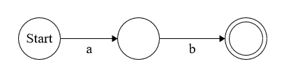
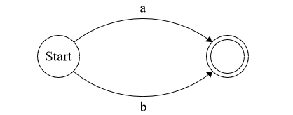
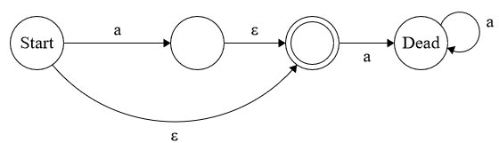
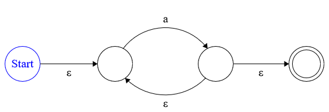
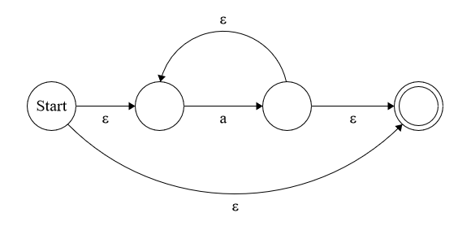

# Introduction
This is a program written in the Python programming language that is able to build **Non-deterministic Finite Automaton (NFA)** when given an input of a **regular expression (regex)**, and uses the **NFA** to determine whether the given **regex** matches any given string.

### Terminology:
1. Automata - Construct made of states that determines whether the input should be **accepted** or **rejected**. i.e. when the machine receives an input it looks at the *states* and picks a state to transition to based on the input it was given. Once there are no more inputs the automaton stops on a state and checks whether it will *accept* or *reject* the current set of inputs.
2. Regular Expressions (Regex) - A string and certain characters contain a special meaning. i.e * = Kleene Star, | = alternation, ? = Zero or One etc.
 - Example of a regex would be:
 - a.b|c* =  **a** followed by a **b** *OR* any number of **c's**, so a valid string would be either **ab** *or* **ccccccccc**, an invalid string could be **acb**, **ccccssss** etc.
3. Non-deterministic Finite Automaton (NFA) - an automaton is a self operating machine designed to follow a sequence of instructions. It takes in a string of inputs and for each symbol(character) it transitions to a new **State**.

### Useful Articles and Sites:
* [Basics of Automata Theory - Stanford.edu](https://cs.stanford.edu/people/eroberts/courses/soco/projects/2004-05/automata-theory/basics.html)
* [Automata Theory Wikipedia](https://en.wikipedia.org/wiki/Automata_theory#Very_informal_description)
* [NFA's Wikipedia](https://en.wikipedia.org/wiki/Nondeterministic_finite_automaton#Informal_introduction)
* [Finite State Machine Designer](http://www.madebyevan.com/fsm/)

### Repository:
- Separated into 2 folders:
- study_research - contains links to useful articles I found while writing the program that explain the core concepts of the program.
- project - contains a sub-directory with all the main components of the program called *utils* and a run.py script which is used to run the program.

### Requirements:
 - [Python3](https://www.python.org/downloads/)
 
# Running the program
1. Install Python3 via the link above.
2. Clone the repository to your desired location via this command:
```
git clone https://github.com/ArnasSteponavicius00/graph_theory_project.git
```
3. Navigate to the project directory and run the program via one of these 2 ways:
```
1. python run.py
```
**OR**
```
2. python run.py -r "[regex]" -s [string]
```
*example of the 2nd method: **python run.py -r "(a.b)|c\*" -s ccccccc***
- The quotation marks for the regex string are very important as command line shells usually have the special characters used in a regex reserved for other actions, which when run without the quotes will cause errors in some scenarios.

# Tests
The utils folder also holds a test.py file, you can run the test file via the following command:  
```
python test.py
```
If all your test cases match the regex then the it will run without issue, if a string does not match a regex then an error message will be displayed showing which strings should match but don't.

### How it works:
```python
if __name__ == "__main__":
    tests = [
            ["a.b|b*", "bbbbbbb", True],
            ["a.b|b*", "bbbn", False],
    ]

    for test in tests:
        assert match(test[0], test[1]) == test[2], test[0] + \
        (" should match " if test[2] else " should not match ") + test[1]
```
The first thing we do is create an array, and the elements of the array will be a list that holds 3 items. As you can guess those 3 things will be the: 
- ["*regex*", "*string to match*", True/False], the True or False is to indicate whether the string should match or not.

The for loop just loops over the elements in the **tests** array, using the **assert** keyword we put the elements into a match() function, which will be covered further down and we check to see whether our match function returned the expected value we put it in our **tests** array.

# Main Algorithms
### state.py
This is the file that defines what a state is. Every state has 0, 1 or 2 *edges*. The class defines *edges* and a *label* for the edges. **Edges** can interpreted as arrows or transitions and the **Labels** are the values given to the edges. So if an edge has the value of "None (epsilon)" it will allow any character to transition along the edge to the next state.

### fragment.py
Uses **state.py** to define the start and accept states of the NFA fragment.

### shunting.py
Used to convert regular infix notation to postfix notation. The way we as people write numbers is in infix notation i.e "3 + 4 or 5 x 2 - (2 - 1)". For a computer this is hard to compute so we convert it to postfix notation. In postfix "3 + 4" now becomes "3 4 +" and "5 x 2 - (2 - 1)" becomes "5 2 2 1 - - x". The way it converts from infix to postfix is by using a stack and constantly pushing and popping symbols to and from the stack.
1. The first step is to take in a string in infix notation, add the symbols (characters) to a list and reverse it.

```python
def shunt(infix):
    """Convert an expression in infix notation to postfix notation
    :param infix: regular expression
    :type infix: string
    :return: infix converted to postfix
    """

    infix = list(infix)[::-1]
```

We then create 2 empty lists that will hold an operator stack and the newly converted postfix expression. We also give the operators that will be used a precedence by assigning them a value, this will determine where the operator will be in the stack once we start the conversion.
```python
 opstack, postfix = [], []
    
    # Operator precedence.
    precedence = {'*': 100, '?': 99,'+': 98, '.': 80, '|': 60, ')': 40, '(': 20}
```

2. The next thing that we do is we create a while loop that loops through the reversed infix list until there are no more characters left. We pop each character as we go along the list and decide what to do with the character based on what it is. If it is an operator character we append it to the **opstack** list and if it is a regular character we append it to the **postfix** list. Once there are no more characters left we then append operators to the **postfix** list and convert it to a string.

```python
    while infix:
        # Pop a character from the input
        print(f"STACK: {infix}")
        cChar = infix.pop()

        # Decide what to do based on the character
        if cChar == '(':
            # Push and open to the opstack stack
            opstack.append(cChar)

        elif cChar == ')':
            # Pop the operator stack until you find an opening bracket
            while opstack[-1] != '(':
                postfix.append(opstack.pop())
            # Get rid of the opening bracket
            opstack.pop()

        elif cChar in precedence:
            # Push any operators on the opstack with higher precedence to the output
            while opstack and precedence[cChar] < precedence[opstack [-1]]:
                postfix.append(opstack.pop())
            # Push cChar to the operator stack
            opstack.append(cChar)

        else:
            # Generally just push the character to the output.
            postfix.append(cChar)

    # Pop all operators to the output
    while opstack:
        postfix.append(opstack.pop())


    # Convert output list to String
    return ''.join(postfix)
```

### regex.py
This is the file that returns the NFA Fragment of the infix notation provided. So therefore we must import the **state.py**, **fragment.py** and **shunting.py** scripts. An infix notation string gets passed in and then converted to postfix notation by passing it to the **shunt()** function. The converted postfix string then gets stored inside a stack, and we also create an empty stack to keep track of the fragments.
```python
from state import State
from fragment import Fragment
from shunting import shunt

def compile(infix):
    # Convert infix to postfix
    postfix = shunt(infix)
    # Make postfix a stack
    postfix = list(postfix)[::-1]
    # Stack to keep track of fragments
    nfa_stack = []
```

Similar to the shunting algorithm we will loop through the postfix stack until there are no more characters, decide how to join multiple states and what state should be the accept state, based upon the operator we read in to create the NFA Fragment. Down below I will explain what each operator implemented in this project does and supply some diagrams of what the fragments look like. I will then talk about how the code achieves creating these fragments.

#### Concatenation (.)

* This NFA checks for an "a" followed by a "b" and the regex of this fragment would be "**a.b**". So how this works is the symbol enters the start state and, we then check whether it matches the character we need to transition to the next state, in this case it's "**a**". Since we match it we transition to next state and we then check if we match the second character given to us in this case "**b**". If it matches we transition to the **accept state**.

#### Alternation (|)

* This one could also be called an "OR" operator and as you can guess it just allows either **a** or **b**. The regex would be written as "**a|b**".

#### Zero or One (?)

* This NFA only accepts a single character or no characters at all, hence the arrow pointing to a dead state if there is another "a" coming after.

#### One or more (+)

* This NFA only accepts when there is atleast one or more of a given character that it is checking for. This is done by creating a loop that it must pass through atleast once. Since this is an NFA we can be in multiple states at any time which is why we can loop back around to take in more inputs and also go to the accept state.

#### Kleene Star (*)

* The Kleene star allows for zero or more inputs. It takes in an input and checks if the character matches. If it does it moves onto the accept state, it also loops back around to take in more inputs of the same character.

### Creating the fragments:
Like I stated above we must create a while loop that will loop through the postfix stack and pop a character from it after each iteration. We then create a new instance of a fragment and append it to our nfa_stack we created. Just before our created instance of our fragment is where we will put a series of if statements that will define where to point our edges to create new fragments depending on the operators. We must also create new start and accept states by calling the State() class
```python
while postfix:
    cChar = postfix.pop()
    
    accept = State()
    start = State(State(label=cChar, edges=[accept])
    
    # New instance of fragment represents NFA
    newFrag = Fragment(start, accept)

    nfa_stack.append(newFrag)
```

#### Concatenation
```python
if cChar == '.':
    # Concatenation
    # Pop two Fragments
    frag1, frag2 = nfa_stack.pop(), nfa_stack.pop()

    # Point frag2 accept state at frag1 start state
    frag2.accept.edges.append(frag1.start)

    start, accept = frag2.start, frag1.accept
else:
    # Create new start and accept states
    accept = State()
    start = State(label=cChar, edges=[accept])
```
The first step we take is to pop the current two fragments from the stack. We then call the accept state of the second fragment (frag2) alongside its edge and we join it together with the start state of the first fragment (frag1). Then we set the new start and accept.

#### Alternation
```python
elif cChar == '|':
    # Alternation
    # Pop two Fragments
    frag1, frag2 = nfa_stack.pop(), nfa_stack.pop()

    # Create new start and accept states
    accept, start = State(), State(edges=[frag1.start, frag2.start])

    # Point old accept state to new one
    frag2.accept.edges.append(accept)
    frag1.accept.edges.append(accept)
else:
    # Create new start and accept states
    accept = State()
    start = State(label=cChar, edges=[accept])
```
The same as concatenation we pop 2 fragments from the stack. Then we create new start and accept states, and assign the state edges to the start state of both fragments (frag1 and frag2). And finally we point the edges to our brand new accept state for both fragments.

#### Zero or One
```python
elif cChar == '?':
    # Zero or One
    '''
    One: accepts one character after the '?'
    Zero: no matches
    accept state is an arrow that points to nothing, so both accept.
    Similar to kleene star, just doesn't point back to itself after
    accepting a character.
    '''
    # Pop one fragment
    frag = nfa_stack.pop()

    # Create new start and accept states
    accept, start = State(), State(edges=[frag.start, accept])

    # Point old accept state to new accept state
    frag.accept.edges.append(accept)
```
This time and the same for the next operators after this we only pop one fragment from the nfa_stack, create the new start and accept states and point the old fragment accept state to the newly created one.

#### One or More
```python
elif cChar == '+':
    # One or more
    '''
    Accepts if there is one character and if more are read in, 
    points back to itself (frag.start)
    '''
    # Pop one fragment
    frag = nfa_stack.pop()

    # Create new start and accept states
    accept, start = State(), State(edges=[frag.start])

    # Point old accept state at the new one
    frag.accept.edges = [frag.start, accept]
```
Create the new accept and start states and we point these new states to the old ones, then we point the old accept state to the new one and if more characters are read in.

#### Kleene Star
```python
elif cChar == '*':
    # Kleene Star (Zero or more)
    # Pop one fragment
    frag = nfa_stack.pop()

    # Create new start and accept states
    accept, start = State(), State(edges=[frag.start, accept])

    # Point arrows
    frag.accept.edges.extend([frag.start, accept])
```
Like above create the new states and point the arrows. Like in the diagrams above the edges point back to itself so it can read in more characters.

### match.py
#### followes(state, current)
This is the function used to follow the edges labelled as None (epsilon) and this works in tandem with the match() function down below. It goes like this. We enter the if statement if we have not seen a state. We then put the state into a set called "current". If the label of the state is None we loop through all the edges and we call the followes function again repeating the process
```python
def followes(state, current):
    """Follows edges labelled as e(psilon)
    :param state: object
    :param current: object
    """
    # Only do this when we haven't seen the state.
    if state not in current:
        # Put the state itself into current
        current.add(state)
        # See whether state is labelled by e(psilon)
        if state.label is None:
            #Loop through states pointed to by this one
            for x in state.edges:
                # Follow all of their e(psilons)
                followes(x, current)
```

#### match(regex, s)
This function will return a true value if the regular expression fully matches the string provided by the user. It returns false otherwise. We start by creating the NFA by passing the regex into the compile function inside **regex.py**. Define 2 sets called **current** and **prev** and call **followes()** on the nfa and current set. Then loop through the characters in the string provided by the user and keep track of where we are in the states. 
```python
def match(regex, s):
    # Compile the regular expression into an NFA
    nfa = compile(regex)

    # Try to match the regex to the string s
    # Current set of states
    current = set()
    followes(nfa.start, current)
    prev = set()

    # Loop through chars in s
    for cChar in s:
        # Keep track of where we are, create new empty set for next state
        prev, current = current, set()
```
Inside the loop we the create another for loop that loops through the previous states and follow the arrows that are not labelled None (epsilon) and if the label matches the character in the string we append the states to the current state. The return a value of True or False as to whether the NFA matches the string provided by the user.
```python
    # Loop through chars in s
    for cChar in s:
        # Keep track of where we are, create new empty set for next state
        prev, current = current, set()
        
        # Loop through previous states
        for state in prev:
            # Only follow arrows not labeled by e(psilon).
            if state.label is not None:
                if state.label == cChar:
                    # Append the state(s) at the end of the arrow to current
                    followes(state.edges[0], current)

    # Ask the NFA if it matches the string s
    return (nfa.accept in current)
```

# References:
* [Ian McLoughlin](https://github.com/ianmcloughlin) - Adapted the project from his videos that were posted online.
* [Regular Expression Matching Can Be Simple And Fast](https://swtch.com/~rsc/regexp/regexp1.html) - This is a very informative article on how to build NFA's. Includes very detailed explanations, code snippets and many diagrams. Some of which I used to figure out how certain operators work such as the "+" and "?" operator.
* [Argparse](https://docs.python.org/dev/library/argparse.html) - Documentation from python on how to add command-line arguments to your python scripts.
* [Finite State Machine Designer](http://www.madebyevan.com/fsm/) - I used this website to draw out the NFA's. It is very simple to use and really helps when it comes to visualize how the transitions to different states work.